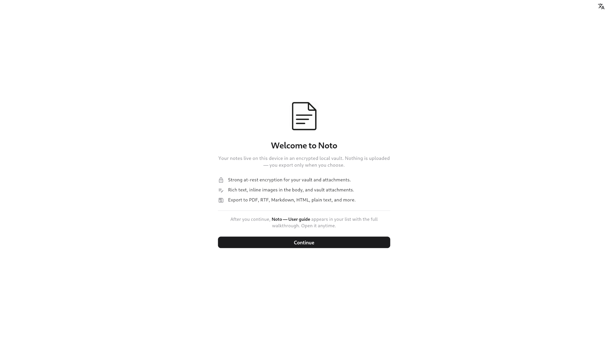
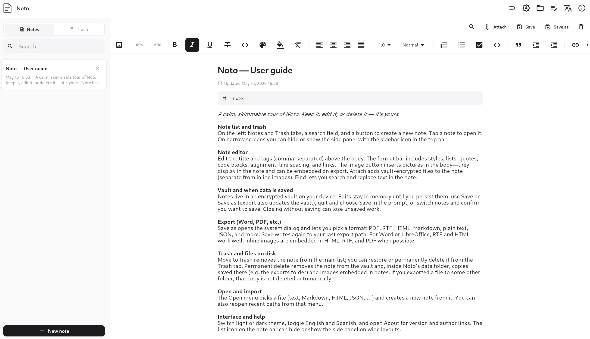

# Noto

Local encrypted notes for Linux and Windows. No accounts, no sync, no cloud.

<br>

<p align="center">
  
</p>

<p align="center">
  
</p>

<br>

---

## Features

- Encrypts your vault, attachments, and embedded images with **AES-256-GCM** — keys live in the OS keyring, never on disk in plaintext
- Rich text editor: bold, italic, lists, code blocks, and inline images
- Export to **PDF, RTF, Markdown, HTML, plain text,** and **JSON**
- Import from text, Markdown, HTML, and JSON — JSON round-trips formatting; the others import as text
- Trash with restore and permanent delete
- Light and dark themes · English and Spanish
- Optional biometric lock on startup

---

## Install on Linux

Download `Noto-<version>-linux-x64.tar.gz` from the
[latest release](https://github.com/AngelAragonMartinez/noto_app/releases/latest),
unpack it anywhere, and run `./noto`. Prebuilt binaries need **glibc 2.36 or
newer** — Debian 12+, Ubuntu 22.04+, Fedora 37+.

On an older distribution, or to register Noto in your app launcher, build from
source. Requires **Flutter SDK ≥ 3.44**:

```bash
git clone https://github.com/AngelAragonMartinez/noto_app.git
cd noto_app
sudo ./install.sh
```

The script installs system dependencies, builds Noto, and registers it in your app launcher.

```bash
sudo ./uninstall.sh   # to remove
```

> On other distributions, install the GTK 3, libsecret, and jsoncpp development packages before running the script.

---

## Install on Windows

Download **`Noto-<version>-windows-x64-setup.exe`** from the
[latest release](https://github.com/AngelAragonMartinez/noto_app/releases/latest)
and run it. No Flutter SDK, no Visual Studio, no command line.

It installs for the current user only, so Windows does not ask for
administrator rights. Uninstall from **Settings ▸ Apps** like any other
program — your notes are left untouched.

Prefer no installer? The same release has
`Noto-<version>-windows-x64-portable.zip`: unzip it anywhere and run
`noto.exe`. Every release also ships `SHA256SUMS-windows.txt` so you can
verify what you downloaded:

```powershell
Get-FileHash .\Noto-1.0.0-windows-x64-setup.exe -Algorithm SHA256
```

> Windows SmartScreen may warn that the publisher is unknown, because the
> installer is not code-signed — a certificate costs money. Choose
> **More info ▸ Run anyway**, or verify the checksum above first.

### Building it yourself instead

Requires **Flutter SDK ≥ 3.44** and **Visual Studio 2022** with the "Desktop
development with C++" workload.

```powershell
git clone https://github.com/AngelAragonMartinez/noto_app.git
cd noto_app
.\install.ps1
```

The script builds Noto in release mode, copies it to
`%LOCALAPPDATA%\Programs\Noto`, and adds a Start Menu shortcut.

```powershell
.\install.ps1 -Uninstall   # to remove
```

> If PowerShell blocks the script with an execution-policy error, run it as
> `powershell -ExecutionPolicy Bypass -File .\install.ps1`, or relax the policy once
> with `Set-ExecutionPolicy -ExecutionPolicy RemoteSigned -Scope CurrentUser`.

---

## Build without installing

```bash
flutter pub get
flutter run -d linux              # debug (Linux)
flutter build linux --release     # release build → build/linux/x64/release/bundle/
```

```powershell
flutter pub get
flutter run -d windows            # debug (Windows)
flutter build windows --release   # release build → build/windows/x64/runner/Release/
```

---

## Your data

Noto keeps everything in one folder:

| Platform | Location |
|---|---|
| Linux | `~/.local/share/noto/notes_app/` |
| Windows | `%APPDATA%\Noto contributors\Noto\notes_app\` |

Inside it, the vault, per-note attachments, and images embedded in note bodies
are all encrypted with AES-256-GCM. Uninstalling Noto leaves this folder
untouched.

Exported files are plaintext — handle them like any sensitive document.

---

## Security

To report a vulnerability, open a [private security advisory](https://github.com/AngelAragonMartinez/noto_app/security/advisories/new) on GitHub rather than a public issue.

---

## License

[MIT](LICENSE)
